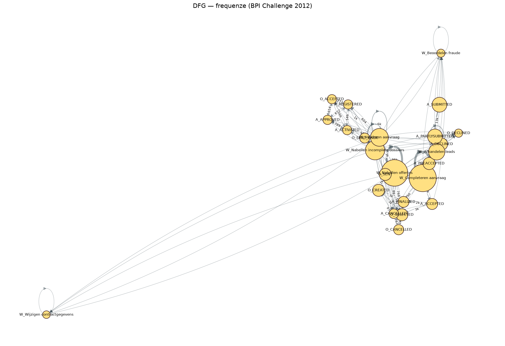
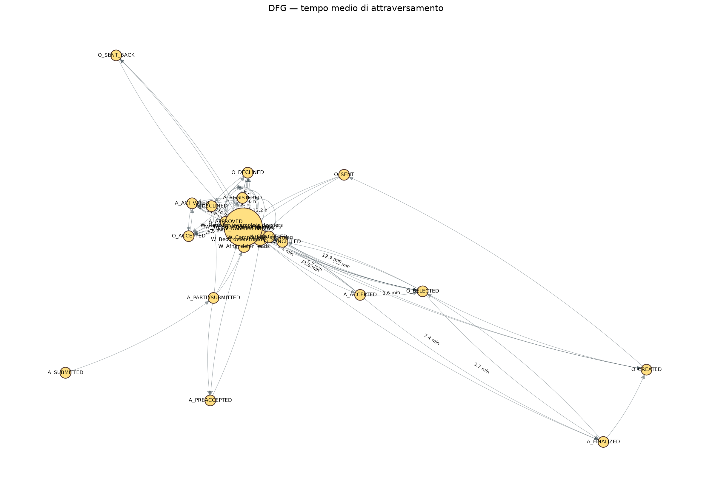
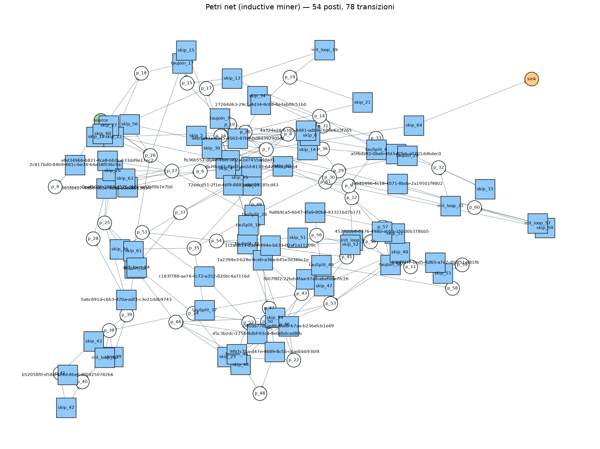
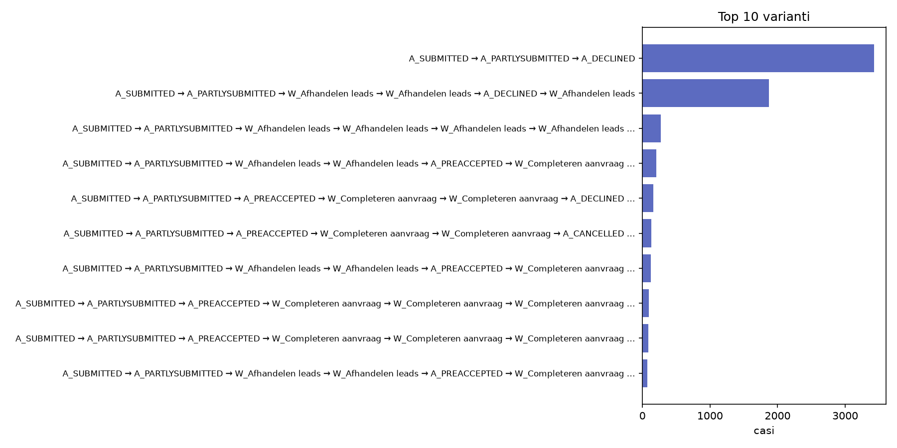
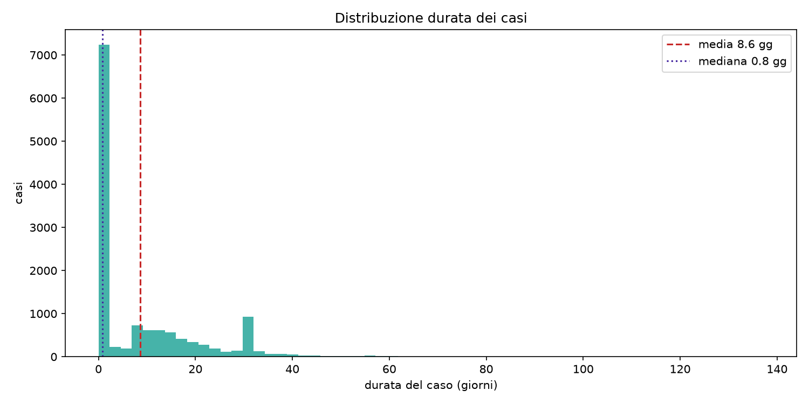

# Process Mining Report — BPI Challenge 2012

Log analizzato: **262,200 eventi**, **13,087 casi**, **24 attività**, 68 risorse (2011-09-30 22:38:44.546000+00:00 → 2012-03-14 15:04:54.681000+00:00).

## 1. Sintesi

- Varianti distinte: **4,379** (top 10 coprono il 49.32% dei casi)
- Durata media dei casi: **8.62 giorni** (mediana 0.81, P90 30.46, P99 46.9)
- Modello (inductive miner): 54 posti, 78 transizioni
- Fitness (token replay): {'perc_fit_traces': 61.7101, 'average_trace_fitness': 0.9887, 'log_fitness': 0.9734, 'percentage_of_fitting_traces': 61.7101}
- Fitness (alignments su 100 casi campione): {'sample_size': 100, 'seconds': 121.5, 'percFitTraces': 100.0, 'averageFitness': 1.0, 'percentage_of_fitting_traces': 100.0, 'average_trace_fitness': 1.0, 'log_fitness': 0.9996}

> Nota metodologica: il token replay è severo su questo log (tracce incomplete e attività duplicate nel modello inductive miner), mentre gli alignments gestiscono correttamente le ambiguità del modello. I due valori vanno letti insieme: l'average trace fitness è ~0.99 in entrambi.

## 2. Top varianti

| # | Passi | Casi | Quota | Percorso |
|---|-------|------|-------|----------|
| 1 | 3 | 3,429 | 26.2% | A_SUBMITTED → A_PARTLYSUBMITTED → A_DECLINED |
| 2 | 6 | 1,872 | 14.3% | A_SUBMITTED → A_PARTLYSUBMITTED → W_Afhandelen leads → W_Afhandelen leads → A_DECLINED → W_Afhandelen leads |
| 3 | 8 | 271 | 2.07% | A_SUBMITTED → A_PARTLYSUBMITTED → W_Afhandelen leads → W_Afhandelen leads → W_Afhandelen leads → W_Afhandelen leads → A_DECLINED → W_Afhandelen leads |
| 4 | 10 | 209 | 1.6% | A_SUBMITTED → A_PARTLYSUBMITTED → W_Afhandelen leads → W_Afhandelen leads → A_PREACCEPTED → W_Completeren aanvraag → W_Afhandelen leads → W_Completeren aanvraag → A_DECLINED → W_Completeren aanvraag |
| 5 | 7 | 160 | 1.22% | A_SUBMITTED → A_PARTLYSUBMITTED → A_PREACCEPTED → W_Completeren aanvraag → W_Completeren aanvraag → A_DECLINED → W_Completeren aanvraag |
| 6 | 7 | 134 | 1.02% | A_SUBMITTED → A_PARTLYSUBMITTED → A_PREACCEPTED → W_Completeren aanvraag → W_Completeren aanvraag → A_CANCELLED → W_Completeren aanvraag |
| 7 | 12 | 126 | 0.96% | A_SUBMITTED → A_PARTLYSUBMITTED → W_Afhandelen leads → W_Afhandelen leads → A_PREACCEPTED → W_Completeren aanvraag → W_Afhandelen leads → W_Completeren aanvraag → W_Completeren aanvraag → W_Completeren aanvraag → A_DECLINED → W_Completeren aanvraag |
| 8 | 9 | 93 | 0.71% | A_SUBMITTED → A_PARTLYSUBMITTED → A_PREACCEPTED → W_Completeren aanvraag → W_Completeren aanvraag → W_Completeren aanvraag → W_Completeren aanvraag → A_DECLINED → W_Completeren aanvraag |
| 9 | 9 | 87 | 0.66% | A_SUBMITTED → A_PARTLYSUBMITTED → A_PREACCEPTED → W_Completeren aanvraag → W_Completeren aanvraag → W_Completeren aanvraag → W_Completeren aanvraag → A_CANCELLED → W_Completeren aanvraag |
| 10 | 14 | 74 | 0.57% | A_SUBMITTED → A_PARTLYSUBMITTED → W_Afhandelen leads → W_Afhandelen leads → A_PREACCEPTED → W_Completeren aanvraag → W_Afhandelen leads → W_Completeren aanvraag → W_Completeren aanvraag → W_Completeren aanvraag → W_Completeren aanvraag → W_Completeren aanvraag → ... |

## 3. Colli di bottiglia (per tempo di servizio medio)

| Attività | Servizio medio | Mediana | Occorrenze | Attesa media verso l'attività successiva |
|----------|----------------|---------|------------|------------------------------------------|
| W_Nabellen offertes | 8.0 gg | 5.1 gg | 97,628 | 30.9 h |
| W_Nabellen incomplete dossiers | 6.6 gg | 2.9 gg | 85,853 | 7.0 h |
| W_Completeren aanvraag | 4.0 gg | 23.2 h | 96,417 | 16.7 h |
| W_Valideren aanvraag | 2.1 gg | 75.2 min | 19,644 | 2.2 h |
| W_Beoordelen fraude | 13.4 h | 4.6 min | 612 | 6.9 h |
| W_Afhandelen leads | 1.5 h | 2.7 min | 7,867 | 2.6 h |

## 4. Rework

Rielaborazioni per attività (somma delle occorrenze; un caso può comparire più volte): **27,362**

| Attività | Casi con ripetizione |
|----------|----------------------|
| W_Completeren aanvraag | 7,367 |
| W_Nabellen offertes | 5,011 |
| W_Afhandelen leads | 4,755 |
| W_Valideren aanvraag | 3,210 |
| W_Nabellen incomplete dossiers | 1,647 |
| O_CREATED | 1,438 |
| O_SELECTED | 1,438 |
| O_SENT | 1,438 |
| O_CANCELLED | 749 |
| O_SENT_BACK | 197 |

## 5. Risorse più attive

| Risorsa | Eventi |
|---------|--------|
| 112 | 45,687 |
| 11169 | 7,825 |
| 10138 | 7,690 |
| 11181 | 7,551 |
| 10861 | 7,382 |
| 10609 | 7,049 |
| 10913 | 6,842 |
| 11189 | 6,778 |
| 11180 | 6,777 |
| 11119 | 6,712 |

## 6. Figure

